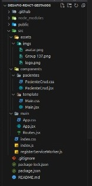

# Desafio React - Gestão DS

Projeto de gestão desenvolvido em React para desafio de Desenvolvedor.

## Estrutura do Projeto

A estrutura do seu projeto é organizada da seguinte forma:

## Pré-requisitos

Antes de começar, certifique-se de ter os seguintes requisitos instalados:

- [Node.js](https://nodejs.org/) - versão 12 ou superior
- [npm](https://www.npmjs.com/) - versão 6 ou superior

## Instalação

1. Clone este repositório: `git clone https://github.com/paulovargas/desafio-react-gestaods.git`
2. Navegue até o diretório do projeto: `cd desafio-react-gestaods`
3. Instale as dependências: `npm install`

## Configuração

Não há configurações adicionais, caso prefira ver o projeto em execução sem baixa-lo está disponivel em https://paulovargas.github.io/desafio-react-gestaods/

## Como Executar

1. No diretório do projeto, execute o seguinte comando: `npm start`
2. Abra o navegador e vá para `http://localhost:3000`

## Scripts

- `npm start`: Inicia o servidor de desenvolvimento.
- `npm run build`: Gera uma versão de produção do aplicativo.
- `npm test`: Executa os testes.
- `npm run deploy`: Faz o deploy do aplicativo no GitHub Pages.

## Tecnologias Principais

- React
- Bootstrap
- Styled Components
- Font Awesome
- ...

## Contribuição

Sinta-se à vontade para contribuir! Veja como você pode ajudar [aqui](CONTRIBUTING.md).

## Licença

Este projeto está licenciado sob a [Licença MIT](LICENSE).

---

Esperamos que este README seja útil para entender a estrutura do projeto e executá-lo localmente. Se você encontrar problemas ou tiver sugestões de aprimoramento, sinta-se à vontade para contribuir.

